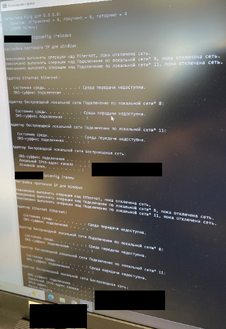
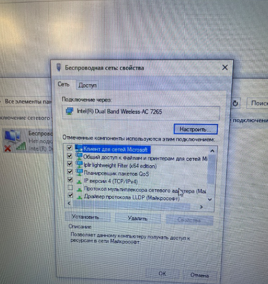
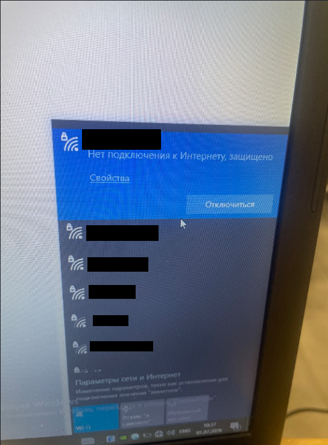
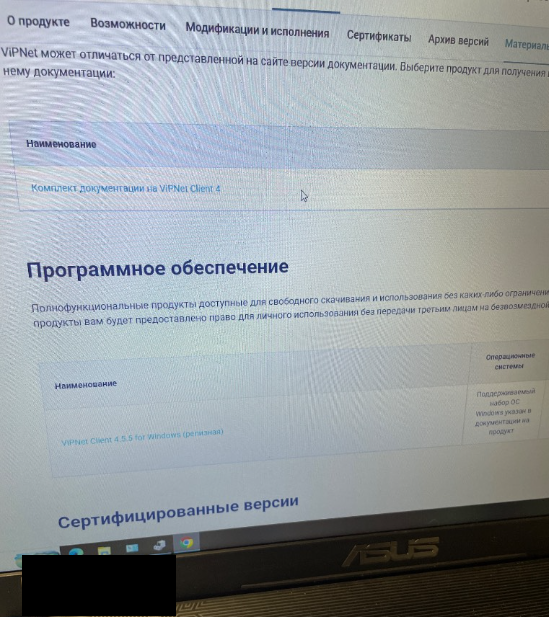
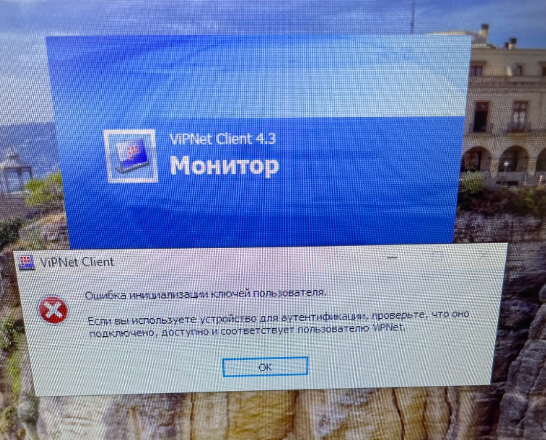

# Enterprise Endpoint Network Stack & NDIS Remediation Toolkit


An automated troubleshooting, diagnostics, and recovery pipeline designed for enterprise Windows workstations experiencing complete Layer 2/Layer 3 network cut-offs caused by static configuration mismatches, NDIS filter driver deadlock, and mismanaged VPN/CSP software.

---

## 1. Problem Statement & Business Impact

### Incident Summary
A mobile enterprise workstation abruptly lost external and internal local network access while remaining associated with an authenticated corporate Wi-Fi network (`"No Internet, Secured"` status).
<details>
<summary> View Diagnostic Logs & Initial Failure Mode</summary>



</details>
 

### Symptoms & Failure Mode
* **DHCP Leases Issued**: The interface successfully negotiated an IPv4 lease (`192.0.2.45/24`) via DHCP.
* **Routing Isolation**: Zero ICMP replies received from the local gateway (`192.0.2.1`), external IP addresses (`1.1.1.1`), or corporate domain controllers (`100% packet loss`).
* **Root Cause 1 (DNS/IP Collision)**: Static DNS parameters had been manually hardcoded onto the adapter while core IP addressing remained on DHCP, preventing authoritative routing lookup.
* **Root Cause 2 (NDIS Filter Driver Interception)**: A proprietary corporate VPN/CSP package (`ViPNet Client` with `Iplir Lightweight Filter`) had its cryptographic layer partially removed without unbinding its low-level kernel filter, locking the TCP/IP stack into default-drop mode.

### Business Risk
Inappropriate manual uninstallation of integrated cryptographic providers can cause system login locks (GINA/Credential Provider failure), loss of digital signature certificates, and extended technician downtime.

---

## 2. Architecture & Solution Design

+-------------------------------------------------------------+|                     Application Layer                       ||           (Browsers, Corporate ERP, Auth Clients)           |+-------------------------------------------------------------+|v+-------------------------------------------------------------+|              Windows TCP/IP Stack (Winsock)                 ||       [Remediation: Cache Flush, Route Normalization]       |+-------------------------------------------------------------+|v+-------------------------------------------------------------+|             NDIS Lightweight Filter Drivers (LWF)           ||  * Problematic State: Deadlock due to removed CSP backend   ||  * Target State: Retain binding, cycle state, recover CSP   |+-------------------------------------------------------------+|v+-------------------------------------------------------------+|               Physical / Wireless Interface                 ||   (DHCP Address Negotiation, Dynamic DNS Resolution via L2) |+-------------------------------------------------------------+
### Technology Stack
* **Language / Orchestration**: PowerShell 5.1+ / Windows Command Processor
* **Diagnostic Protocols**: ICMP, ARP, DNS (`Resolve-DnsName`), NetTCPIP
* **Host Subsystems**: NDIS (Network Driver Interface Specification), Windows Filtering Platform (WFP), Microsoft CryptoAPI / CSP Architecture

---

## 3. Step-by-Step Deployment & Remediation

### Prerequisites
* Windows 10 / 11 Enterprise or Windows Server 2016+
* Local Administrative privileges (`Run as Administrator`)
* Access to enterprise vendor software repository (for CSP recovery packages)

### Quick Start: Automated Execution
Run the automated repair script via an elevated PowerShell session:

```powershell
# Clone or navigate to the script directory
cd scripts/

# Execute diagnosis and restore dynamic DHCP/DNS settings
.\Repair-EndpointNetwork.ps1 -TargetAdapterAlias "Wi-Fi" -ResetDnsToDhcp
```

### Manual Emergency Runbook (If Automation Is Unavailable)

1. **Re-establish Dynamic Addressing**:
   ```cmd
   netsh interface ip set address "Wi-Fi" dhcp
   netsh interface ip set dns "Wi-Fi" dhcp
   ```

2. **Re-initialize Kernel Networking Layers**:
   ```cmd
   netsh winsock reset
   netsh int ip reset
   route -f
   ipconfig /flushdns
   ```

3. **Handle Encrypted Network Filters Safely**:
   * Do **not** blindly delete registry-linked CSP suites if tokens or certificates are registered.
   * If an NDIS driver (`Iplir lightweight Filter`) intercepts traffic, disable the specific binding via adapter properties without removing the host application until keys are backed up.
   * Reinstall the authorized CSP / VPN client build via official vendor deployment packages to re-register the credential providers.
<details>
<summary> View Network Isolation & Process Deadlock Artifacts</summary>




</details>

---

## 4. Verification & Healthcheck

Validate that the adapter has returned to operational baseline using the following checklist:

| Check | Command | Expected Output |
| :--- | :--- | :--- |
| **DHCP State** | `Get-NetIPInterface -InterfaceAlias "Wi-Fi"` | `Dhcp: Enabled` |
| **Gateway Reachability** | `Test-Connection -TargetName <Gateway-IP> -Count 2` | `True` (0% packet loss) |
| **DNS Resolution** | `Resolve-DnsName -Name example.com` | IP Record returned successfully |
| **Internet Reachability** | `curl.exe -I https://example.com` | `HTTP/2 200` or valid handshake |

---

## 5. Lessons Learned & Operational Post-Mortem

* **Avoid destructive uninstalls during active routing deadlocks**: Cryptographic software (such as ViPNet CSP / CryptoPro) often hooks into Windows Credential Providers. Deleting the suite while keys are assigned locks local accounts out upon reboot.
* **Always verify L3 before condemning physical L1/L2 adapters**: Static DNS entries combined with local client isolation often imitate physical hardware failure.
* **Audit NDIS driver bindings early**: Third-party NDIS filter drivers can silently drop ICMP packets while DHCP  handshakes appear successful.